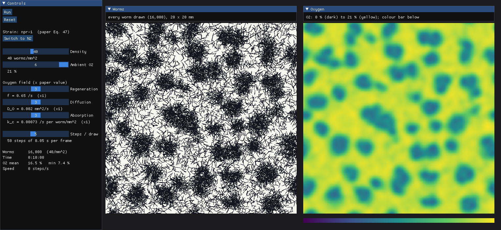

# C. elegans · Model 2

Worm agents on an oxygen field, following Demir et al., eLife 2020 (Eqs. 45–47 and the paper's
parameter values). Each worm moves at speed V(O) and turns at random; nothing else. Bacteria are an
optional, clearly labelled extension.



## Run

Taichi needs Python 3.12 or older.

```bash
/opt/homebrew/bin/python3.12 -m venv .venv
./.venv/bin/pip install -r requirements.txt
./.venv/bin/python -m model2             # opens the window (Apple GPU via Metal)
./.venv/bin/python -m model2 --arch cpu  # CPU instead
```

Press **Run** (or Space). *Steps / draw* fast-forwards; it changes display speed, not physics.
Density changes apply on **Reset**; everything else applies live.

Other commands:

```bash
./.venv/bin/python check.py                  # npr-1 density x O2 grid, saved to results/
./.venv/bin/python check.py --strain N2
./.venv/bin/python -m model2 --screenshot results/screenshot.png --minutes 10
./.venv/bin/python -m pytest tests -q
```


## Files


| File               | What it is                                         |
| ------------------ | -------------------------------------------------- |
| `model2/params.py` | every constant, with its source                    |
| `model2/sim.py`    | the simulation (Taichi kernels)                    |
| `model2/app.py`    | the window                                         |
| `check.py`         | headless density × oxygen grid                     |
| `DESIGN_NOTES.md`  | equations, assumptions, design discussion, results |
| `PLAN.md`          | the build plan                                     |


